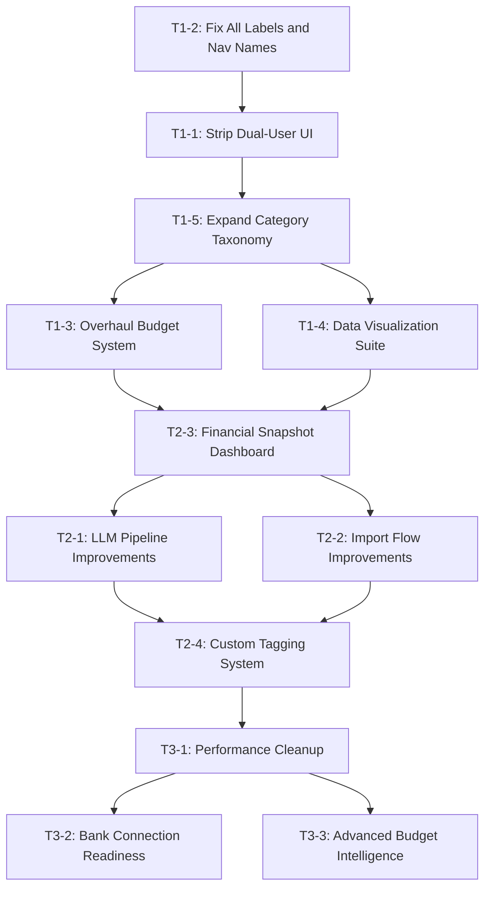

# Abyssol — Personal Finance App: Development Roadmap

**Generated:** 2026-05-07  
**Codebase:** Vanilla JS ES Modules + Chart.js + Supabase (Auth, DB, Edge Functions) + GitHub Actions  
**Stack files reviewed:** `finance/index.html`, `finance/js/app.js`, `finance/js/ui.js`, `finance/js/charts.js`, `finance/js/calculators.js`, `finance/js/state.js`, `finance/js/api.js`, `finance/js/auth.js`, `finance/css/base.css`, `finance/css/layout.css`, `finance/css/components.css`, `finance/css/dashboard.css`

---

## Executive Summary

The application has a strong technical foundation — Supabase auth, Edge Functions for LLM processing, Chart.js visualizations, and a clean ES module structure — but carries significant UX debt from what appears to be an incomplete pivot from a dual-user household finance tool to a single-user personal finance tracker. Several features are partially wired but functionally broken (budget chart), and the taxonomy is far too coarse-grained for meaningful personal finance tracking. The roadmap below addresses all five critical issues plus the six additional improvement areas, organized into three priority tiers.

---

## Codebase Findings: Root Cause Analysis

### 1. Budget Chart Non-Functional — Root Cause

`updateBudget()` in [`finance/js/ui.js`](finance/js/ui.js:189) sums all filtered expenses into one number (`automatedExp`) and passes it to `calculateCashFlow()` in [`finance/js/calculators.js`](finance/js/calculators.js:21). That function simply relabels the single total as "personal discretionary" and draws a 3-segment donut (spending / shared contribution / leftovers). There are **no per-category budget limits defined anywhere in the codebase**, no comparison of actual spend to a user limit, no projections, and no alert thresholds. The "Personal Expense Engine" accordion in the budget tab contains static number inputs (`expHousingPrimary`, `expAutoPrimary`) that are never read by any calculation — they are vestigial UI from a prior design.

### 2. Dual-User Artifacts — Full Inventory

Every item below is confirmed present in the source and must be removed or repurposed:

| Location | Artifact |
|---|---|
| [`finance/index.html:95`](finance/index.html:95) | `sharedContribution` field — "Shared Household Contribution (Black Box)" |
| [`finance/index.html:365`](finance/index.html:365) | `spouseHousingContribution` input |
| [`finance/index.html:426`](finance/index.html:426) | `spouseAutoContribution` input |
| [`finance/index.html:290`](finance/index.html:290) | Budget tab header: "Split Finance Budget" |
| [`finance/index.html:358`](finance/index.html:358) | Housing section: "28/36 Housing Rule (Split Setup)" |
| [`finance/index.html:419`](finance/index.html:419) | Auto section: "20/4/10 Auto Financing (Split Setup)" |
| [`finance/index.html:410`](finance/index.html:410) | `maxHousing` label: "Max Total Monthly (Combined)" |
| [`finance/index.html:466`](finance/index.html:466) | `maxTransport` label: "Max Monthly Transport (Combined)" |
| [`finance/index.html:301`](finance/index.html:301) | Budget line: "Shared Household Obligation" |
| [`finance/js/state.js:8`](finance/js/state.js:8) | `state.sharedContribution` |
| [`finance/js/calculators.js:21`](finance/js/calculators.js:21) | `calculateCashFlow` — accepts `sharedContribution` as core variable |
| [`finance/js/calculators.js:33`](finance/js/calculators.js:33) | `calculateHousingMatrix` — `spouseContrib` parameter |
| [`finance/js/calculators.js:74`](finance/js/calculators.js:74) | `calculateAutoMatrix` — `spouseContrib` parameter |
| [`finance/js/ui.js:27`](finance/js/ui.js:27) | `hydrateUI` hydrates `sharedContribution` |

### 3. Naming Convention Issues — Full Audit

| Current | Proposed Replacement | Location |
|---|---|---|
| "Total Overview" (nav) | "Dashboard" | hamburger menu |
| "Current Budget" (nav) | "My Budget" | hamburger menu |
| "Data Sync" (nav) | "Import Statements" | hamburger menu |
| "FIRE Projector" (nav) | "Retirement Planner" | hamburger menu |
| "Purchase Matrix" (nav) | "Affordability" | hamburger menu |
| "Benchmarking" (nav) | "Income Rank" | hamburger menu |
| "Multi-View Analytics" (header) | "Spending Charts" | tab-overview |
| "Persistent Ledger" (header) | "My Transactions" | tab-overview |
| "AI Financial Analyst" (header) | "AI Insights" | tab-overview |
| "Split Finance Budget" (header) | "My Budget" | tab-budget |
| "Personal Expense Engine" (header) | "Spending by Category" | tab-budget |
| "Personal Socioeconomic Percentile" | "My Income Rank" | tab-benchmarking |
| "Geo-Arbitrage Engine" | "Compare Cost of Living" | tab-benchmarking |
| "Secure Statement Upload" | "Import Bank Statements" | tab-sync |
| "Personal Annual Gross" (label) | "Annual Salary / Income (before tax)" | profile modal |
| "Income & Black Box" (section) | "Income" | profile modal |
| "Credit & Deep Demographics" (section) | "About Me" | profile modal |
| "Shared Household Contribution (Black Box)" | REMOVE | profile modal |
| "Current Personal Liquidity / Portfolio" | "Savings & Investments" | profile modal |
| "Global Filters" | "Filters" | filter bar |
| "Total Spend" (KPI) | "Total Spending" | KPI cards |
| "Net Cash Flow" (KPI) | "Money Left Over" | KPI cards |
| "Exp" (type option) | "Expense" | add-transaction form |
| "Inc" (type option) | "Income" | add-transaction form |
| "Uncat" (category option) | "Uncategorized" | add-transaction form |
| "AI Optimize" (button) | "Get AI Suggestions" | budget tab |
| "✨ Generate Insights" (button) | "Analyze My Spending" | overview tab |

### 4. Visualization Gaps

| Chart | Status | Notes |
|---|---|---|
| Monthly income/spend timeline | Exists | `drawHistoryChart()` — basic, no trend line |
| Category donut | Exists | `drawCategoryDonutChart()` — no time slice |
| Merchant bar chart | Exists | `drawMerchantChart()` — top 10 only |
| Budget donut | Exists but broken | Uses wrong 3-bucket data, not category limits |
| FIRE projection | Exists | `drawFireChart()` — functional |
| Bell curve / income rank | Exists | `drawBellCurve()` — functional |
| Category time-series | **MISSING** | Food/Transport spending across months |
| Month-over-month comparison | **MISSING** | Side-by-side category bars by month |
| Spending trend line | **MISSING** | Velocity / moving average overlay |
| Per-category budget progress | **MISSING** | Bar with limit, actual, projected |
| Custom date range filter | **MISSING** | Only "All", "30 days", "90 days" |

### 5. Architectural / Performance Issues

- [`triggerCalculations()`](finance/js/ui.js:80) re-renders ALL five tab sections on every input change with no selective invalidation
- [`drawHistoryChart()`](finance/js/charts.js:7) and all other chart functions call `chart.destroy()` then recreate from scratch — should use `chart.data = ...; chart.update()` instead
- [`fetchLocationData()`](finance/js/api.js:30) is called on every `triggerCalculations()` invocation — no cache TTL
- [`renderFlatLedger()`](finance/js/ui.js:106) rebuilds the entire transaction list DOM on every render — no diff or incremental update
- The `CATEGORIES` array in [`finance/js/ui.js:6`](finance/js/ui.js:6) is duplicated from hardcoded HTML `<option>` tags — no single source of truth
- Debug `console.log` statements remain in production code: [`finance/js/auth.js`](finance/js/auth.js:9)
- No loading skeleton / spinner states for most async operations
- CSP header includes `unsafe-inline` — should be tightened once inline styles are moved to classes

---

## Priority Tier 1 — Critical Fixes

These directly break the stated product purpose or create user-facing dysfunction.

---

### T1-1: Strip Dual-User Interface Entirely

**Scope:** Medium  
**Files:** `finance/index.html`, `finance/js/state.js`, `finance/js/ui.js`, `finance/js/calculators.js`, `finance/js/app.js`, `finance/js/auth.js`, `finance/css/dashboard.css`

**What to do:**

1. Remove `sharedContribution` from [`state.js`](finance/js/state.js) and all references throughout `ui.js`, `calculators.js`, and `app.js`
2. Remove `spouseHousingContribution` and `spouseAutoContribution` inputs from [`index.html`](finance/index.html)
3. Remove the "Shared Household Obligation" budget line item and its corresponding `budgetShared` display
4. Remove the "(Split Setup)" subheadings from the housing and auto affordability sections
5. Update `calculateHousingMatrix()` in [`calculators.js`](finance/js/calculators.js:33) — remove `spouseContrib` parameter; solo-user max is purely income-based
6. Update `calculateAutoMatrix()` in [`calculators.js`](finance/js/calculators.js:74) — same
7. Update `calculateCashFlow()` in [`calculators.js`](finance/js/calculators.js:21) — remove `sharedContribution` subtraction; return `netMonthlyIncome`, `totalSpend`, `leftOver`
8. Update `saveUserProfile()` / `fetchUserProfile()` in [`api.js`](finance/js/api.js) and `hydrateUI()` in [`ui.js`](finance/js/ui.js) to no longer persist or hydrate `shared_contribution`
9. Rewrite the budget donut to use category-level data (see T1-3)
10. Update the "Max Total Monthly (Combined)" labels to "Your Maximum Monthly"

**State after:** Every reference to a second person, spouse, or shared obligation is removed. Calculations are based purely on the individual user's income and transaction history.

---

### T1-2: Plain-Language Naming Audit

**Scope:** Small  
**Files:** `finance/index.html` (primary), `finance/js/ui.js` (secondary for JS-set text)

**What to do:**

Apply every rename from the audit table in section 3 above. Key implementation notes:

1. In [`app.js`](finance/js/app.js:19), the `switchView()` function sets `.textContent` for `trendsHeaderTitle` — update these strings: "Timeline & Cash Flow" → "Income & Spending Over Time", "Category Breakdown" → "Spending by Category", "Merchant Drill-Down" → "Top Merchants"
2. In [`ui.js`](finance/js/ui.js), `updateBenchmarking()` sets `detailedPercentiles.textContent` — update to plain language
3. Update the `<title>` tag: "Abyssol | Financial Intelligence" is fine but can stay; focus on in-app labels
4. Rename the hamburger nav items in the order they should be presented to a user naturally: Dashboard → My Budget → Affordability → Retirement Planner → Income Rank → Import Statements
5. Replace abbreviated dropdown options ("Exp", "Inc", "Uncat") with their full words

**State after:** A user with no financial background can navigate every feature without reading a tooltip.

---

### T1-3: Budget System Overhaul

**Scope:** Large  
**Files:** `finance/index.html`, `finance/js/ui.js`, `finance/js/calculators.js`, `finance/js/state.js`, `finance/js/api.js`, Supabase `budget_limits` table (new)

**What to do:**

#### Database
Create a new Supabase table `budget_limits`:
```
budget_limits (
  id uuid primary key,
  user_id uuid references auth.users,
  category text not null,
  monthly_limit numeric not null,
  updated_at timestamptz
)
```

#### State
Add to [`state.js`](finance/js/state.js): `budgetLimits: {}` — keyed by category name, value is monthly limit amount.

#### API
Add two functions to [`api.js`](finance/js/api.js):
- `fetchBudgetLimits(userId)` — SELECT from `budget_limits`
- `saveBudgetLimit(userId, category, limit)` — UPSERT

#### Calculators
Add `calculateBudgetStatus(transactions, budgetLimits)` to [`calculators.js`](finance/js/calculators.js):
- Filter transactions to current calendar month
- Sum spend per category
- For each category in `budgetLimits`: compute `actual`, `limit`, `remaining`, `percentUsed`, `projectedMonthEnd`
- `projectedMonthEnd` = `actual / (daysElapsed / daysInMonth)`
- Return array of `{ category, actual, limit, remaining, percentUsed, projectedMonthEnd, isOverBudget, isNearBudget }`

#### HTML / UI
Replace the current budget tab content with:
1. **Month selector** — dropdown to pick which month to view (default: current month)
2. **Category budget rows** — for each category: editable limit input, filled progress bar showing `actual / limit`, dollar figures for spent / remaining, projected end-of-month spend
3. **Alert indicators** — icon or color change when `percentUsed >= 80%` (warning) or `>= 100%` (over budget)
4. **Budget summary card** — total budgeted vs. total spent for the month, overall percentage used
5. **"Set Budget" inline editing** — click a number to edit the limit in-place; debounced save to Supabase
6. Remove the broken budget donut; replace with a horizontal stacked bar chart showing all categories

#### Wiring
In `auth.js`, after `fetchTransactions()`, also call `fetchBudgetLimits()` and store in `state.budgetLimits`. In `updateBudget()` in [`ui.js`](finance/js/ui.js:189), call the new `calculateBudgetStatus()` and render the redesigned tab.

**State after:** The budget tab automatically populates from real transaction data. Users can set per-category monthly limits. Progress bars and alerts update in real time as transactions are added or imported.

---

### T1-4: Data Visualization Suite

**Scope:** Large  
**Files:** `finance/js/charts.js`, `finance/js/ui.js`, `finance/js/calculators.js`, `finance/index.html`

**Architecture decision:** Keep Chart.js (already loaded). Add chart update paths using `chart.data = ...; chart.update()` instead of always destroying. Introduce a `currentMonth` / `rangeMonths` filter for the visualization suite separate from the global ledger filter.

#### New Charts to Build

**Chart A: Category Time-Series (Line Chart)**
- Selector: pick one or multiple categories
- X-axis: months (e.g., Jan → May); Y-axis: spend amount
- One line per selected category, each a different color
- Useful for: "Is my food spending trending up over the last 6 months?"
- New function: `drawCategoryTimeSeriesChart(categories, monthlyData)`
- New calculator: `groupTransactionsByCategoryAndMonth(transactions)` — returns `{ category: { 'YYYY-MM': total } }`

**Chart B: Month-over-Month Comparison (Grouped Bar Chart)**
- X-axis: categories; grouped bars for each of the last N months
- Filter: pick 2–6 months to compare
- Useful for: "Did I spend more on food in April than March?"
- New function: `drawMonthComparisonChart(months, categoryData)`

**Chart C: Trend Line Overlay**
- Add a 3-month rolling average line to the existing `drawHistoryChart()` timeline
- Overlay on the existing spend bars as a second dataset
- Calculation: `calculateRollingAverage(monthlyTotals, windowSize = 3)`

**Chart D: Spending Pace / Projection Card (not a chart, a KPI)**
- Calculate: `dailyRate = currentMonthSpend / daysElapsed`
- `projectedTotal = dailyRate * daysInMonth`
- Display as a KPI card: "At your current pace, you'll spend $X by end of month"
- Color-coded relative to income: green if projected < income, red if over

#### UI Changes
- Add a fourth toggle button to the analytics section: "Trends" (alongside Timeline / Category / Merchant)
- "Trends" view shows Chart A (category time-series) with category multi-select
- Add a fifth toggle: "Compare" showing Chart B (month-over-month)
- Timeline view gets Chart C (rolling average) overlay as a toggle checkbox
- Add the spending pace KPI card to the Overview KPI grid (5th card)
- Expand the date filter from 3 options to: All Time / This Month / Last 3 Months / Last 6 Months / Last 12 Months / Custom (month picker)

**State after:** The app has 5 distinct chart modes, a rolling average overlay, a spending pace projection, and a useful date range picker beyond "30/90 days."

---

### T1-5: Expanded Category Taxonomy

**Scope:** Medium  
**Files:** `finance/js/ui.js`, `finance/index.html`, `finance/js/app.js` (LLM prompt), `finance/js/calculators.js`

**Design:** Use a two-level hierarchy: parent category + subcategory. Store as a single string `"Food & Dining > Groceries"` in the `category` field to avoid a schema migration on existing data. The separator `>` allows easy splitting for display and grouping logic.

#### Proposed Taxonomy

```
Food & Dining
  Groceries
  Restaurants & Dining Out
  Coffee & Cafes
  Fast Food
  Bars & Alcohol
  Food Delivery

Transportation
  Gas & Fuel
  Car Payment
  Car Insurance
  Parking
  Rideshare (Uber / Lyft)
  Public Transit
  Tolls & Fees
  Car Maintenance

Housing
  Rent / Mortgage
  HOA Fees
  Renters / Homeowners Insurance
  Home Maintenance
  Furniture & Decor

Utilities
  Electric
  Water & Sewer
  Gas / Heat
  Internet
  Cell Phone
  Trash

Entertainment
  Streaming Services
  Music Subscriptions
  Movies & Events
  Gaming
  Hobbies
  Books & Media

Health & Wellness
  Health Insurance
  Doctor & Urgent Care
  Prescriptions
  Dental
  Vision
  Gym & Fitness
  Mental Health
  Personal Care

Shopping
  Clothing & Apparel
  Electronics
  Home Goods
  Online Shopping
  Gifts

Financial
  Savings Transfer
  Investments
  Credit Card Payment
  Loan Payment
  Bank Fees

Education
  Student Loans
  Tuition & Courses
  Books & Supplies

Travel
  Flights
  Hotels & Lodging
  Vacation Activities

Personal & Family
  Childcare
  Pet Care
  Haircuts & Grooming

Business Expenses
  Work Supplies
  Software & Subscriptions
  Professional Services

Uncategorized
```

#### Implementation

1. Create a `CATEGORY_TAXONOMY` constant in a new `finance/js/categories.js` module — the single source of truth for all categories. Export it. Import it in `ui.js`, `app.js`, and `index.html` (via the module).
2. Update all `<select>` category dropdowns to use `<optgroup label="Parent">` with `<option>` for each subcategory
3. Update the filter bar to support parent-level filtering (e.g., "All Food & Dining") or subcategory filtering
4. Update `groupTransactionsByCategory()` in [`calculators.js`](finance/js/calculators.js:132) to support grouping by parent category (strip after `>`) or by full subcategory
5. Update the LLM prompt in [`app.js:240`](finance/js/app.js:240) to instruct the model to use the new full taxonomy with subcategories
6. Maintain backward compatibility: on render, if a stored category string doesn't contain `>`, treat it as a legacy parent category and display it as-is in the dropdown

**State after:** Each transaction can be categorized at a meaningful level (e.g., "Food & Dining > Groceries" vs. "Food & Dining > Dining Out"). All charts and budget tracking respect both parent and subcategory groupings.

---

## Priority Tier 2 — High-Value Improvements

These are not broken but represent significant product quality gaps.

---

### T2-1: LLM Categorization Pipeline Improvements

**Files:** `finance/js/app.js`, Supabase Edge Function `process-statement`

#### Confidence Scoring
- Update the Edge Function prompt to request a `confidence` field (0.0–1.0) per transaction
- Store `confidence` in the `transactions` table (new column, nullable float)
- In `renderFlatLedger()`, visually flag low-confidence transactions (< 0.7) with a color indicator (amber) so users know to verify them

#### User Correction Feedback Loop
- When a user manually changes a category via the inline `<select>` dropdown, record the `(clean_merchant, old_category, new_category)` triplet
- Store corrections in a new `categorization_corrections` table: `(user_id, merchant_name, corrected_category, created_at)`
- When processing new statements, inject the top-N merchant corrections for that user into the LLM prompt as few-shot examples: "When you see 'WHOLE FOODS', categorize as 'Food & Dining > Groceries'"
- This creates a self-improving feedback loop without any model fine-tuning

#### Recurring Merchant Memory
- After each statement import, build a `merchant_category_map` by frequency-voting the most common category per merchant across the user's history
- Inject the top-50 most-seen merchants and their agreed category into each new LLM prompt
- This eliminates repeated miscategorization of known merchants like Amazon (could be Shopping or Business)

#### Ambiguous Transaction Handling
- For transactions with `confidence < 0.6`, surface a "Review Needed" badge in the ledger
- Add a filter option in the ledger: "Show uncategorized / low confidence"

---

### T2-2: Transaction Import Flow Improvements

**Files:** `finance/js/app.js`, `finance/index.html`

#### Duplicate Detection
- Before inserting into Supabase, run a check: for each new transaction, query `transactions` for matching `(user_id, date, amount, clean_merchant)` within a tolerance window
- If a match exists, skip the transaction and track it in a `duplicates` count
- Report: "47 new transactions imported. 3 duplicates skipped."

#### Drag-and-Drop Upload Zone
- Add `dragover`, `dragenter`, `dragleave`, `drop` event listeners to the `#uploadDropzone` element in [`index.html:551`](finance/index.html:551)
- Visual feedback on drag-over (border color change, scale up)
- Currently the dropzone is cosmetic-only — wire it up

#### CSV-Specific Path
- If `file.name.endsWith('.csv')`, parse the CSV client-side first (no need to upload to storage for small files) using a lightweight parser
- Detect common bank CSV column formats automatically (Date, Description, Debit, Credit vs. Date, Amount, Memo, etc.)
- Show a column-mapping UI before sending to LLM: "Which column is the date? Which is the amount?"

#### Import Progress Feedback
- Replace single `statusEl.textContent` updates with a multi-step progress indicator: Upload (done) → Process (loading) → Save (done)
- Show transaction count and category summary after import: "5 food, 3 transport, 2 uncategorized"

#### Multi-File Queue
- Allow selecting multiple files at once; process them sequentially with per-file progress

---

### T2-3: Financial Snapshot / Net Worth Dashboard

**Files:** `finance/index.html`, `finance/js/ui.js`, `finance/js/state.js`, `finance/js/calculators.js`

This becomes the natural landing tab, replacing "Total Overview" as the first experience after sign-in.

#### Components
1. **Net Flow KPIs** (already partially exist — keep and clean up): Income, Spending, Money Left Over, Savings Rate
2. **Month-to-Date Status card**: Days elapsed, spending so far this month, projected end-of-month total, daily average
3. **Savings Rate Gauge**: Circular progress showing percentage of income saved this month — green above 20%, amber 10–20%, red below 10%
4. **Top 3 Spending Categories this month**: Mini bar list with amounts
5. **Recent Transactions list**: Last 5–10 transactions in a compact view
6. **Quick Add**: Compact inline form for adding a single transaction without scrolling

#### State Changes
- Add `state.netWorth` as a computed value: `portfolio` (from profile) minus any manually entered liabilities
- Add a liabilities input to the profile modal: "Credit Card Debt", "Student Loans", "Car Loan Balance", "Other Debt" — each optional number field
- `netWorth = state.portfolio - sum(liabilities)`
- Show net worth prominently on the dashboard

---

### T2-4: Custom Transaction Tagging System

**Files:** `finance/index.html`, `finance/js/ui.js`, `finance/js/calculators.js`, `finance/js/api.js`, Supabase `transaction_tags` table

#### Database
```
transaction_tags (
  transaction_id uuid references transactions(id),
  user_id uuid references auth.users,
  tag text not null,
  primary key (transaction_id, tag)
)
```

Or simpler: add a `tags text[]` column directly to the `transactions` table if schema migration is straightforward.

#### UI
- In each ledger row, add a tag input field (compact pill-style) — click to add a tag
- Show existing tags as removable chips (e.g., 🏷 "business" × )
- Support autocomplete from the user's previously used tags

#### Filter Integration
- Add a tag filter to the global filter bar (multi-select)
- Filtering by tag "business" shows all tagged transactions regardless of category
- This enables cross-category analysis: all business meals + business flights + business software in one view

#### Use Cases to Highlight in UI
- "Trip to NYC" — tag all expenses during a travel period
- "Business" — tag reimbursable work expenses
- "John's birthday" — tag gift and dinner expenses for a specific occasion

---

## Priority Tier 3 — Future Enhancements

These are valuable but should wait until Tier 1 and Tier 2 are stable.

---

### T3-1: Performance & Architectural Cleanup

**Priority within tier:** Do this before adding more features — technical debt will compound.

#### Selective Rendering
- Split `triggerCalculations()` into targeted update functions: `updateOverviewSection()`, `updateBudgetSection()`, etc.
- Each section tracks a `needsUpdate` dirty flag; only the active visible tab is re-rendered immediately; background tabs are marked dirty and rendered on next activation
- This eliminates the cost of recalculating FIRE projections when the user types in the income field on the Overview tab

#### Chart Update Instead of Destroy
- Replace `chart.destroy()` + `new Chart()` pattern with `chart.data.datasets[0].data = newData; chart.update()` in all six chart functions in [`charts.js`](finance/js/charts.js)
- Only create a new Chart instance if the canvas context doesn't already have one

#### Location Data Caching
- In [`ui.js`](finance/js/ui.js:83), `fetchLocationData()` is called on every `triggerCalculations()` invocation
- Add a module-level cache: `const locationCache = {}; if (locationCache[loc]) return locationCache[loc];`

#### Single Source of Truth for Categories
- Create `finance/js/categories.js` containing `CATEGORY_TAXONOMY`, `FLAT_CATEGORIES` (for backward compat), `getCategoryParent(cat)`, `getCategoryColor(cat)`
- Remove the duplicated `CATEGORIES` array in [`ui.js:6`](finance/js/ui.js:6) and all hardcoded `<option>` tags that repeat the same list

#### Remove Debug Logging
- Strip the `console.log('[DEBUG] ...)` statements from [`auth.js`](finance/js/auth.js:9)
- Add a `const DEBUG = false;` flag and gate any future diagnostic logging behind it

#### Loading States
- Add CSS skeleton loaders for the transaction ledger while `fetchTransactions()` is in flight
- Show a spinner on the chart canvas area while data is being processed

#### Error Boundaries
- The upload flow's `try/catch` in [`app.js:227`](finance/js/app.js:227) is solid but other async paths silently fail via `console.warn`
- Show inline error messages in the UI rather than failing silently for `fetchUserProfile`, `saveUserProfile`, `fetchBudgetLimits`

---

### T3-2: Bank Connection Readiness (Plaid / MX)

**Scope:** Major future feature

**What to plan now:**
- The `addTransaction()` and batch insert patterns in [`api.js`](finance/js/api.js:103) are already compatible with programmatic bank data
- Add a `source` field to the `transactions` table: `'manual' | 'csv_upload' | 'pdf_upload' | 'plaid' | 'mx'`
- Add a `external_id` field for deduplication using the bank's transaction ID
- The duplicate detection logic from T2-2 is the prerequisite for bank connections — bank feeds are notorious for sending the same transaction multiple times
- Plan the Supabase Edge Function for Plaid webhooks: `POST /functions/v1/plaid-webhook` → verify → upsert transactions
- UI: add "Connect a Bank" button in the Import Statements tab (disabled/coming-soon state) so users know it's on the roadmap

---

### T3-3: Advanced Budget Intelligence

- **Budget templates**: pre-populated limits based on 50/30/20 rule using the user's actual income — one-click "auto-set budget"
- **Month rollover**: if user underspends a category by $50, optionally roll it into next month's limit
- **Annual budget view**: 12-month grid showing actual vs. budget per category per month — like a personal P&L statement
- **Budget vs. peer comparison**: integrate with the benchmarking data to show if the user's food budget is above or below average for their location

---

## Implementation Sequence

The following Mermaid diagram shows the recommended order of work:



**Rationale for order:**
- Labels must be fixed first so that subsequent code changes reference the correct IDs and text
- Dual-user removal unlocks the correct data model for budget and calculators
- Category taxonomy must exist before the budget system references categories
- Budget system and visualization suite can be built in parallel once taxonomy lands
- Dashboard consolidation comes after both budget and visualization are functional
- LLM and import improvements layer on top of the stable core

---

## Files That Will Be Touched in Each Tier

| File | T1 | T2 | T3 |
|---|---|---|---|
| `finance/index.html` | Heavy rewrite | Moderate additions | Minor |
| `finance/js/state.js` | Add `budgetLimits`, remove `sharedContribution` | Add `netWorth`, `tags` | Minor |
| `finance/js/api.js` | Add budget CRUD | Add dedup, tags CRUD | Bank webhook types |
| `finance/js/calculators.js` | Fix `calculateCashFlow`, add budget calc, fix category grouping | Add rolling avg, pace | Add annual view |
| `finance/js/charts.js` | Add 3 new chart types, fix destroy/update | Minor | Chart perf |
| `finance/js/ui.js` | Major rework of `updateBudget`, add new chart renders | Dashboard section | Dirty flags |
| `finance/js/app.js` | Update LLM prompt for new taxonomy, fix label JS | Import improvements | Debug cleanup |
| `finance/js/auth.js` | Add `fetchBudgetLimits` call | Minor | Strip debug logs |
| `finance/js/categories.js` | **NEW FILE** — taxonomy constant | Tag colors | — |
| `finance/css/dashboard.css` | Budget progress bars, new chart containers | Tag chips | Skeleton loaders |
| Supabase: `budget_limits` table | **NEW** | — | — |
| Supabase: `categorization_corrections` table | — | **NEW** | — |
| Supabase: `transaction_tags` table | — | **NEW** | — |
| Supabase: `transactions` (add `confidence`, `source`, `tags[]`) | Add `confidence` | Add `tags[]` | Add `source`, `external_id` |

---

## Open Questions to Resolve Before Implementation

1. **Budget limits scope**: Should budget limits be per-subcategory (e.g., "Food & Dining > Groceries: $400/mo") or only per parent category ("Food & Dining: $700/mo")? Recommend starting with parent-level for simplicity; subcategory support in T3.
2. **Liabilities for net worth**: Should debt balances be manually entered (simple, accurate) or estimated from transaction history (automatic, approximate)? Recommend manual entry initially.
3. **FIRE tab**: "FIRE Projector" being renamed to "Retirement Planner" — should the 25x rule and safe withdrawal rate remain, or should the tool be simplified for a general audience unfamiliar with FIRE methodology? The calculations are sound; just label them clearly.
4. **Household type / demographics in profile**: The race, sex, and education fields exist for benchmarking percentile comparisons. These are sensitive demographic fields. Confirm the intent to keep them vs. removing the benchmarking tab or making these fields completely optional with tooltips explaining why they improve accuracy.
5. **"Shared Contribution" repurposing**: Some users genuinely have a fixed monthly expense that is a household contribution (e.g., paying into a joint account). This field could be repurposed as "Fixed Monthly Transfer Out" (e.g., to savings, to a partner's account) rather than deleted entirely — it would flow through `calculateCashFlow()` as a fixed expense deduction. Confirm preference.
